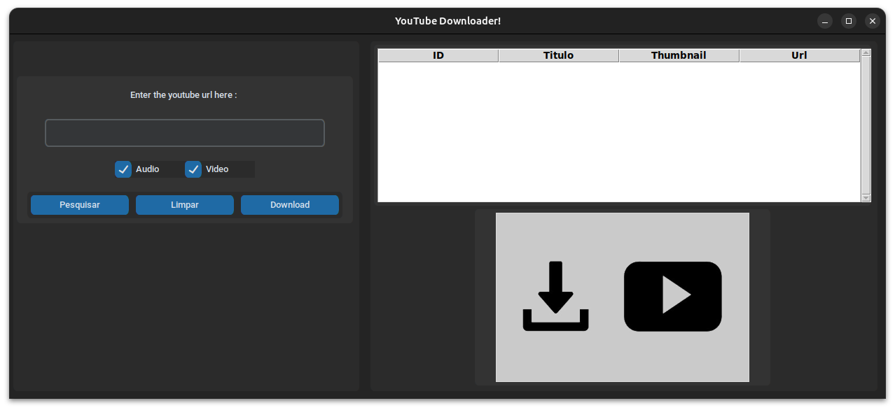

# Video Downloader

## Copiando projeto
```bash
git@github.com:murilopaixao/videoDownloader.git
```

```bash
cd videoDownloader
```

## Ambiente virtual
```bash
python -m venv venv

source venv/bin/activate
sudo apt install python3-tk -y
```

## Instalando dependências
```bash
pip install -r requirements.txt
```

## Executando
```bash
python app.py
```



# Encerrando

```bash
deactivate
cd ..
rm -rf videoDownloader
```